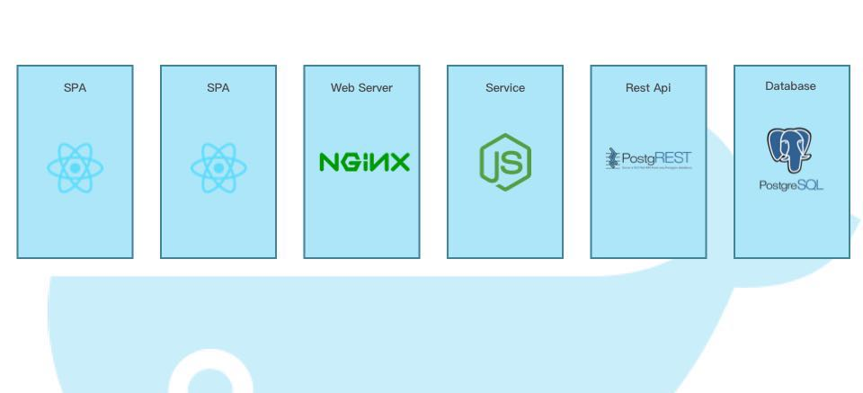

Docker + PostgreSQL + PostgREST + Nginx + NodeJS apps + React apps + API Test

- Nginx to serve React apps as static files
- NodeJS for backend service
- PostgREST for Restful api
- PostgreSQL, the best database in the world
- API Test, ava + superagent to test asserts declared in YML files

#### Nginx ⇋ React apps

Nginx is ideal for static files, need to

  - change PUBLIC_URL in react apps
  - add router for react apps

```
"build": "PUBLIC_URL=/app react-scripts build",


<Route path="/app" component={Application} />
```

#### Nginx ⇋ PostgREST

- Nginx route `/api` to PostgreREST
- Nginx control the access of api

#### Nginx ⇋ NodeJS

- Nginx as reverse proxy for to NodeJS apps

#### NodeJS ⇋ React apps

- socket.io

#### NodeJS ⇋ Postgresql

- listen/notify

------

### Run locally



```
# sh dev.sh
```

- localhost:3001 -> React app1
- localhost:3002 -> React app2
- localhost:9001/node -> NodeJS
- localhost:9001/api -> Postgrest

### Deploy remotely


#### Feature

- data schema and api schema separated
- postgresql role and Row Level Policy for ACL
- create view for hiding column in api
- login and register
- use cookie after login
- Postgres notify
- Postgres notify -> NodeJS -> socket.io

#### TODO

- pre-request validation
- blacklist
- send email
- auth login: wechat/facebook
- token refresh
- HTTPS Everywhere
- 3 sub-systems: app/community, app/ecommerce, app/financial

#### How to send email?

##### simplified way

1. trigger on insert table mail
2. send notification with payload in the trigger function
3. use Nodejs to receive the notification
4. send mail in Nodejs with the payload

##### complex way

Postgres notify -> NodeJS -> RabbitMQ -> Mailer
